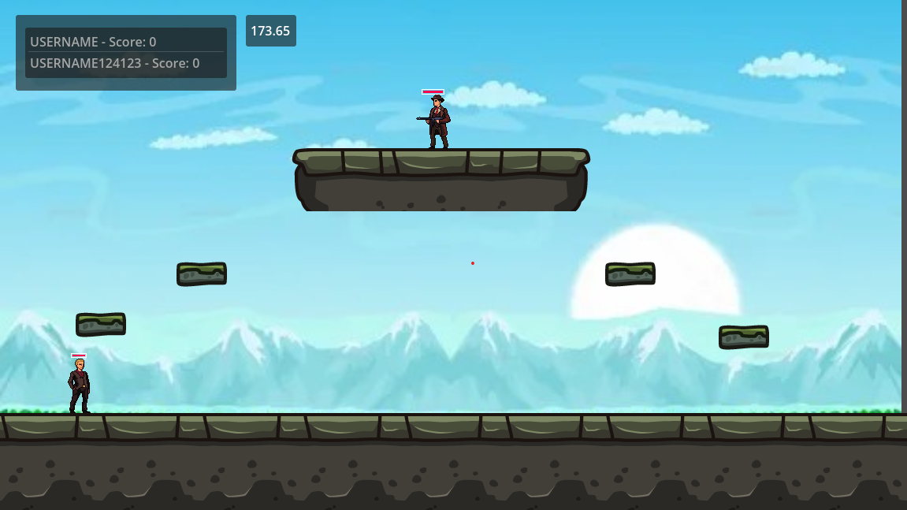
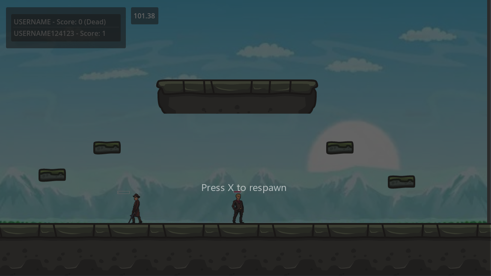

# Kill2

**Kill2** is a fast-paced 2D shooter game built with **Godot** and powered by a **Python server**.  
The game logic runs on the server and communicates with clients through a **WebSocket** connection.

---

## Features
- 🎮 **Multiplayer gameplay** with real-time synchronization.
- ⚡ **Server-side game logic** written in Python.
- 🌐 **WebSocket-based networking** for low-latency communication.
- 🕹️ **Godot engine** for smooth 2D graphics and animations.

---

## Tech Stack
- **Game Engine:** [Godot](https://godotengine.org/)
- **Backend:** Python
- **Networking:** WebSocket

---

## Screenshots
<!-- Add in-game images here -->

